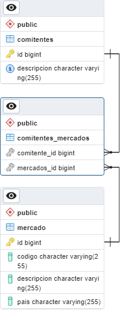

# Decrypto Challenge

This project is a simple API REST CRUD of Entities in java with Spring following good practices.

## Installing / Getting started

Clean and install dependencies using maven.

```
mvn clean install
```

Running the application 

```
mvn spring-boot:run
```

## Developing

### Build with

* Java 11
* Spring boot 2.7.8
* PostgreSQL 

## Database

PostgreSQL version 14. 



Database name: 
* decrypto.

Schema: 
* public.

Tables: 
* comitentes
* comitentes_mercados
* mercado

## Swagger 

http://localhost:8080/api/swagger-ui/index.html#/